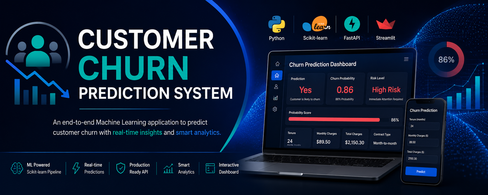
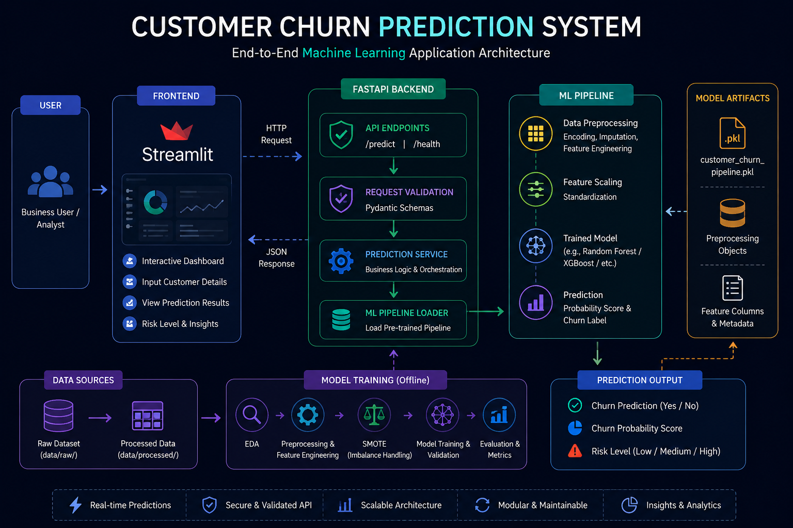
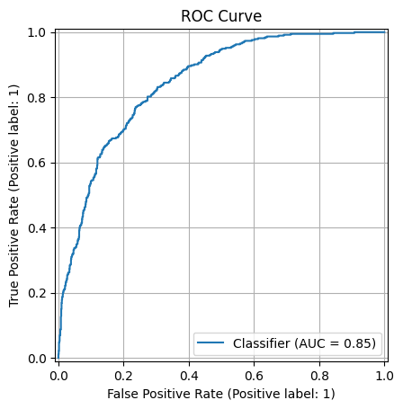
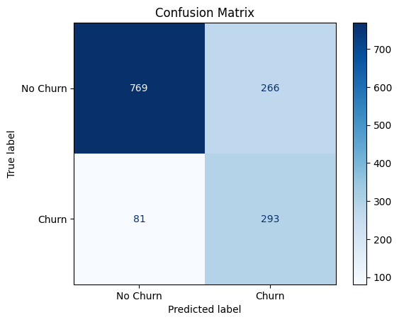
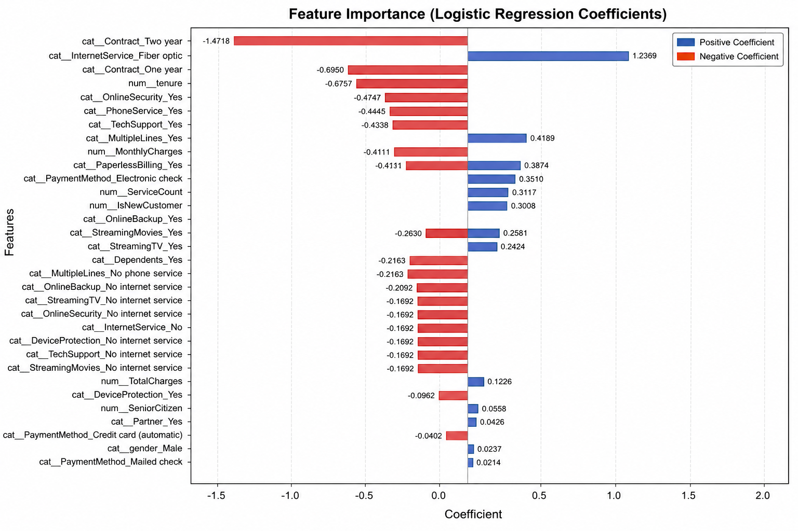
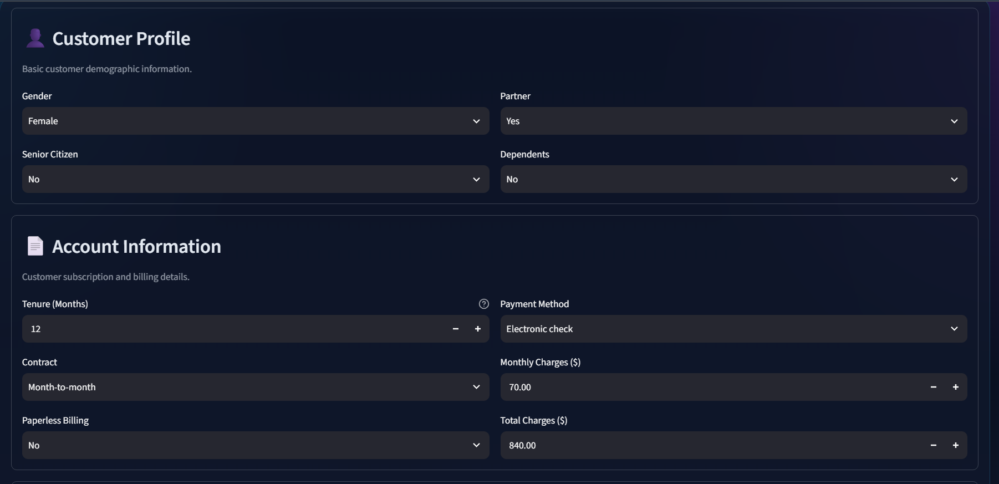
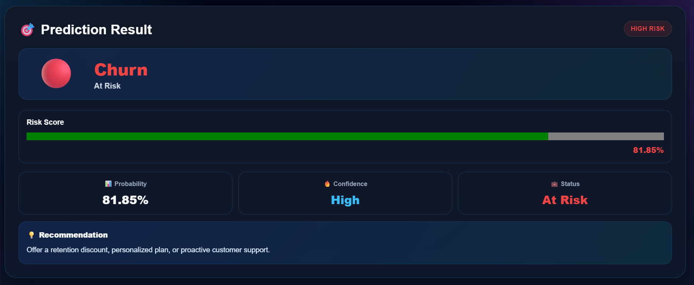
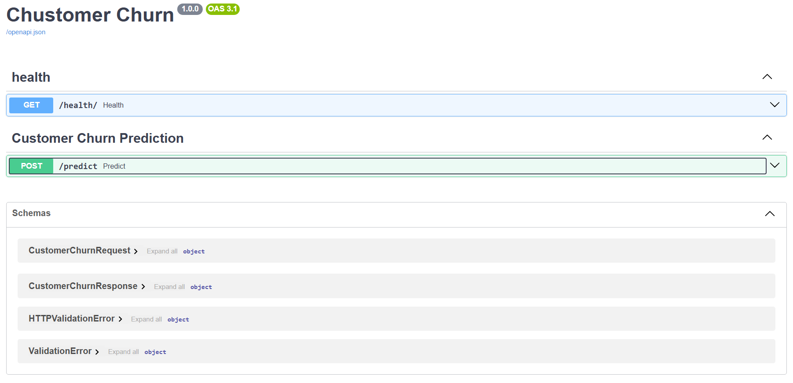

<p align="center">
  
</p>

<h1 align="center">
📉 Customer Churn Prediction System
</h1>

<p align="center">
An End-to-End Machine Learning application that predicts customer churn using a production-ready Scikit-learn pipeline, FastAPI backend, and an interactive Streamlit dashboard.
</p>

<p align="center">


</p>

---

## 🚀 Project Highlights

- 🤖 End-to-End Machine Learning Pipeline
- ⚡ FastAPI REST API for Real-Time Predictions
- 🎨 Interactive Streamlit Dashboard
- 📊 Cross-Validated Machine Learning Model
- 📈 Churn Probability & Risk Analysis
- 🧩 Modular Backend Architecture
- 💾 Production-Ready Model Pipeline
- 🔍 Clean & Scalable Code Structure

---
# 📚 Table of Contents

- [📖 Project Overview](#-project-overview)
- [🎯 Problem Statement](#-problem-statement)
- [✨ Key Features](#-key-features)
- [🎥 Demo](#-demo)
- [📂 Dataset](#-dataset)
- [🛠 Tech Stack](#-tech-stack)
- [🏗 System Architecture](#-system-architecture)
- [📁 Project Structure](#-project-structure)
- [🤖 Machine Learning Pipeline](#-machine-learning-pipeline)
- [🧠 Models Evaluated](#-models-evaluated)
- [📊 Model Performance](#-model-performance)
- [🌐 REST API](#-rest-api)
- [🖼 Application Screenshots](#-application-screenshots)
- [⚙ Installation](#-installation)
- [▶ How to Run](#-how-to-run)
- [🚀 Future Improvements](#-future-improvements)
- [👨‍💻 Author](#-author)
- [📄 License](#-license)

---
# 📖 Project Overview

Customer churn is one of the biggest challenges faced by subscription-based businesses such as telecom, banking, insurance, and SaaS companies. Identifying customers who are likely to leave enables businesses to take proactive retention measures, reducing customer loss and increasing long-term revenue.

This project presents an **end-to-end Machine Learning solution** that predicts whether a customer is likely to churn based on demographic information, account details, and subscribed services.

The system is designed with a **production-oriented architecture**, combining a trained **Scikit-learn Machine Learning pipeline**, a **FastAPI backend**, and an **interactive Streamlit frontend** to deliver real-time predictions.

### 🎯 What this project provides

- 🔍 Real-time customer churn prediction
- 📈 Churn probability score
- ⚠️ Customer risk level analysis
- 🌐 RESTful API built with FastAPI
- 🎨 User-friendly Streamlit dashboard
- 🧩 Modular backend architecture
- 💾 Production-ready serialized ML pipeline
- 📊 Cross-validated machine learning model

This project demonstrates the complete lifecycle of a machine learning application—from data preprocessing and feature engineering to model training, evaluation, deployment, and user interaction.

---
# 🎯 Problem Statement

Customer retention is a critical business challenge for subscription-based companies. Acquiring a new customer often costs significantly more than retaining an existing one, making early churn prediction an essential business objective.

Traditional methods rely on manual analysis and historical trends, which are often time-consuming and less effective in identifying at-risk customers.

The objective of this project is to develop a machine learning solution capable of predicting customer churn based on customer demographics, account information, subscribed services, and billing details. By identifying customers who are likely to churn, businesses can implement targeted retention strategies, improve customer satisfaction, and reduce revenue loss.

This project demonstrates the complete lifecycle of a production-ready machine learning application, including data preprocessing, feature engineering, model training, evaluation, deployment, and real-time prediction through a web interface.

---
# ✨ Key Features

### 🤖 Machine Learning

- End-to-End Machine Learning Pipeline
- Feature Engineering & Data Preprocessing
- SMOTE for Class Imbalance Handling
- Hyperparameter Tuning
- Stratified Cross Validation
- Probability-based Predictions
- Production-ready Serialized Pipeline (Joblib)

---

### ⚡ Backend

- FastAPI REST API
- Modular Project Architecture
- Pydantic Request & Response Validation
- Centralized Logging
- Exception Handling
- Health Check Endpoint
- High-performance Prediction Service

---

### 🎨 Frontend

- Interactive Streamlit Dashboard
- Real-Time Prediction
- User-Friendly Interface
- Input Validation
- Responsive Layout
- Probability Visualization
- Risk Level Indicator

---

### 📊 Model Evaluation

- Accuracy
- Precision
- Recall
- F1 Score
- ROC-AUC
- Confusion Matrix
- ROC Curve
- Feature Importance Analysis

---

### 🛠 Software Engineering

- Clean Folder Structure
- Modular Codebase
- Separation of Frontend & Backend
- Environment-based Configuration
- Reusable Components
- Easy Deployment
- Git Version Control

---
# 🎥 Demo

## 🖥 Application Demo

The Customer Churn Prediction System provides a complete workflow for predicting customer churn through an intuitive web interface.

### Workflow

1. User enters customer information.
2. Streamlit validates the input.
3. Data is sent to the FastAPI backend.
4. Backend preprocesses the data using the saved ML pipeline.
5. The trained model predicts customer churn.
6. Prediction probability and risk level are returned.
7. Results are displayed instantly on the dashboard.

---

## 🎬 Demo GIF

<p align="center">

</p>


---
# 📂 Dataset

## Overview

This project uses the **Telco Customer Churn Dataset**, a widely used benchmark dataset for binary classification problems in customer analytics.

The dataset contains customer demographic information, subscribed services, account details, and billing information, with the objective of predicting whether a customer will discontinue the service.

---

## Dataset Statistics

| Property | Value |
|----------|-------|
| Domain | Customer Analytics |
| Problem Type | Binary Classification |
| Target Variable | Churn |
| Number of Features | 20 |
| Records | 7,043 |
| Missing Values | TotalCharges |
| Class Labels | Yes / No |

---

## Feature Categories

### 👤 Customer Information

- Gender
- Senior Citizen
- Partner
- Dependents

---

### 📞 Services

- Phone Service
- Multiple Lines
- Internet Service
- Online Security
- Online Backup
- Device Protection
- Tech Support
- Streaming TV
- Streaming Movies

---

### 💳 Account Information

- Tenure
- Contract Type
- Paperless Billing
- Payment Method
- Monthly Charges
- Total Charges

---

### 🎯 Target Variable

```text
Churn

Yes  → Customer Left

No   → Customer Stayed
```

---

## Data Preprocessing

The following preprocessing steps were performed before model training:

- Missing Value Handling
- Feature Encoding
- Feature Scaling
- Class Imbalance Handling using SMOTE
- Train-Test Split
- Cross Validation
- Feature Selection
- Pipeline Serialization using Joblib

---
# 🛠 Tech Stack

| Category | Technologies |
|----------|--------------|
| Programming Language | Python |
| Machine Learning | Scikit-learn, Pandas, NumPy |
| Backend Framework | FastAPI |
| Frontend Framework | Streamlit |
| API Server | Uvicorn |
| Data Validation | Pydantic |
| Model Serialization | Joblib |
| Visualization | Matplotlib, Plotly |
| Development | Jupyter Notebook |
| Version Control | Git & GitHub |

---

## 💻 Libraries Used

### Machine Learning

- Scikit-learn
- Pandas
- NumPy
- Joblib

---

### Backend

- FastAPI
- Uvicorn
- Pydantic

---

### Frontend

- Streamlit

---

### Visualization

- Matplotlib
- Plotly

---

### Development Tools

- VS Code
- Git
- GitHub
- Jupyter Notebook

---
# 🏗 System Architecture

<p align="center">

</p>

---

## Architecture Overview

The application follows a modular architecture where the frontend, backend, and machine learning pipeline are decoupled to improve maintainability and scalability.

### Workflow

1. The user enters customer information through the Streamlit dashboard.
2. The frontend sends the request to the FastAPI backend.
3. FastAPI validates the incoming request using Pydantic schemas.
4. The prediction service loads the trained Machine Learning pipeline.
5. Input data is preprocessed using the saved preprocessing pipeline.
6. The trained model predicts customer churn.
7. Prediction probability and confidence are calculated.
8. The backend returns the response to the frontend.
9. Streamlit displays the prediction, probability score, and customer risk level.

---

## Architecture Components

### 🎨 Frontend

- Streamlit Dashboard
- Customer Input Form
- Prediction Visualization
- REST API Client

---

### ⚡ Backend

- FastAPI
- Pydantic Validation
- Prediction Service
- API Routing
- Error Handling

---

### 🤖 Machine Learning

- Data Preprocessing Pipeline
- Feature Engineering
- Trained Classification Model
- Probability Prediction
- Serialized Joblib Pipeline

---

### 🔄 Communication Flow

```text
Customer Input
        │
        ▼
 Streamlit Dashboard
        │
 REST API Request
        ▼
 FastAPI Backend
        │
 Request Validation
        ▼
 Prediction Service
        │
 ML Pipeline (.pkl)
        ▼
 Prediction + Probability
        │
 REST API Response
        ▼
 Streamlit Dashboard
```

---
# 📁 Project Structure

The project follows a modular architecture by separating the frontend, backend, machine learning pipeline, and supporting assets. This structure improves maintainability, scalability, and code organization.

```text
customer-churn-prediction/
│
├── backend/
│   ├── app/
│   │   ├── api/
│   │   ├── core/
│   │   ├── schemas/
│   │   ├── services/
│   │   ├── utils/
│   │   └── main.py
│   │
│   └── models/
│       └── customer_churn_pipeline.pkl
│
├── frontend/
│   ├── app.py
│   └── api_client.py
│
├── data/
│   ├── raw/
│   └── processed/
│
├── notebooks/
│   ├── 01_DATASET_EXPLORE.ipynb
│   ├── 02_DATASET_PREPROCESS.ipynb
│   ├── 03_Check_LowFeature_SMOTE.ipynb
│   └── 04_Model_Prediction.ipynb
│
├── assets/
│   ├── banner.png
│   ├── architecture.png
│   ├── ml_pipeline.png
│   ├── workflow.png
│   └── demo.gif
│
├── screenshots/
│
├── README.md
├── requirements.txt
├── LICENSE
└── .gitignore
```

---

### Folder Description

| Folder | Description |
|----------|-------------|
| backend | FastAPI backend and prediction service |
| frontend | Streamlit user interface |
| data | Raw and processed datasets |
| notebooks | EDA, preprocessing, training, and evaluation notebooks |
| assets | README graphics and diagrams |
| screenshots | UI and evaluation screenshots |

---
# 🤖 Machine Learning Pipeline

<p align="center">

</p>

---

## Pipeline Overview

The project implements a complete machine learning pipeline that automates preprocessing, model training, evaluation, and deployment.

The trained preprocessing steps and classification model are combined into a single serialized pipeline using **Joblib**, ensuring identical preprocessing during inference.

---

## Pipeline Stages

### 📂 Data Collection

- Load customer dataset
- Verify data quality

↓

### 🧹 Data Cleaning

- Handle missing values
- Remove inconsistencies

↓

### ⚙ Feature Engineering

- Encode categorical variables
- Scale numerical features
- Generate model-ready features

↓

### ⚖ Handle Class Imbalance

- Apply SMOTE
- Balance churn and non-churn classes

↓

### ✂ Train-Test Split

- Stratified train-test split

↓

### 🤖 Model Training

- Train multiple ML algorithms
- Hyperparameter tuning
- Cross Validation

↓

### 📊 Model Evaluation

- Accuracy
- Precision
- Recall
- F1 Score
- ROC-AUC

↓

### 💾 Model Serialization

- Save preprocessing pipeline
- Save trained model
- Export Joblib pipeline

---
# 🧠 Models Evaluated

Multiple machine learning algorithms were evaluated to identify the best-performing model for customer churn prediction.

| Model | Accuracy | Precision | Recall | F1 Score | ROC-AUC |
|-------|----------:|----------:|-------:|---------:|---------:|
| Logistic Regression | **0.8041** | **0.6644** | **0.5294** | **0.5893** | **0.8460** |
| XGBoost | 0.7921 | 0.6278 | 0.5321 | 0.5760 | 0.8264 |
| Random Forest | 0.7899 | 0.6364 | 0.4866 | 0.5515 | 0.8247 |
| Decision Tree | 0.7303 | 0.4915 | 0.4652 | 0.4780 | 0.6451 |

---

## Final Model Selection

The **Logistic Regression** was selected as the final model because it achieved the best balance between:

- Highest ROC-AUC
- Strong Recall
- Better F1 Score
- Stable Cross Validation Performance

This makes it suitable for customer churn prediction where identifying customers likely to churn is often more important than maximizing overall accuracy.

---
# 📊 Model Performance

The final model was evaluated using Stratified K-Fold Cross Validation to ensure reliable and unbiased performance across different data splits.

---

## Performance Metrics

| Metric | Score |
|--------|------:|
| Accuracy | **0.7402** |
| Precision | **0.5068** |
| Recall | **0.7968** |
| F1 Score | **0.6195** |
| ROC-AUC | **0.8458** |

---

## Cross Validation

The model was validated using **Stratified K-Fold Cross Validation**, providing consistent performance across multiple folds.

| Metric | Mean | Standard Deviation |
|--------|-----:|-------------------:|
| Accuracy | **0.7639** | 0.0114 |
| Precision | **0.5383** | 0.0149 |
| Recall | **0.7746** | 0.0297 |
| F1 Score | **0.6351** | 0.0196 |
| ROC-AUC | **0.8449** | 0.0107 |

---

## Model Evaluation Visualizations

### ROC Curve

<p align="center">

</p>

---

### Confusion Matrix

<p align="center">

</p>

---

### Feature Importance

<p align="center">

</p>

---

### Performance Summary

The final model demonstrates:

- High recall for identifying customers likely to churn
- Strong ROC-AUC indicating good class separation
- Balanced precision and recall
- Stable cross-validation performance
- Production-ready inference pipeline

---
# 🌐 REST API

The backend is developed using **FastAPI**, providing a lightweight and high-performance REST API for real-time churn prediction.

---

## Base URL

```text
http://127.0.0.1:8000
```

---

## Prediction Endpoint

```http
POST /predict
```

---

## Sample Request

```json
{
    "gender": "Female",
    "SeniorCitizen": 0,
    "Partner": "Yes",
    "Dependents": "No",
    "tenure": 24,
    "PhoneService": "Yes",
    "MultipleLines": "No",
    "InternetService": "Fiber optic",
    "OnlineSecurity": "No",
    "OnlineBackup": "Yes",
    "DeviceProtection": "No",
    "TechSupport": "No",
    "StreamingTV": "Yes",
    "StreamingMovies": "Yes",
    "Contract": "Month-to-month",
    "PaperlessBilling": "Yes",
    "PaymentMethod": "Electronic check",
    "MonthlyCharges": 89.5,
    "TotalCharges": 2210.30
}
```

---

## Sample Response

```json
{
    "prediction": "No Churn",
    "probability": 0.91,
    "risk_level": "Low"
}
```

---

## API Features

- FastAPI REST API
- Automatic Swagger Documentation
- Request Validation using Pydantic
- JSON Responses
- Error Handling
- Health Check Endpoint
- Production-ready Architecture

---
# 🖼 Application Screenshots

## Customer Input Form

<p align="center">

</p>

---

## Prediction Result

<p align="center">

</p>

---

## Swagger Documentation

<p align="center">

</p>

---
# ⚙ Installation

## Clone the Repository

```bash
git clone https://github.com/Mohit1605/customer-churn

cd customer-churn-prediction
```

---

## Create Virtual Environment

### Windows

```bash
python -m venv .venv

.venv\Scripts\activate
```

### Linux / macOS

```bash
python3 -m venv .venv

source .venv/bin/activate
```

---

## Install Dependencies

```bash
pip install -r requirements.txt
```

---

## Project Requirements

- Python 3.11+
- Git
- pip

---
# ▶️ How to Run

Follow these steps to run the project locally.

---

## Step 1: Start the FastAPI Backend

Navigate to the backend directory:

```bash
cd backend
```

Run the FastAPI server:

```bash
uvicorn app.main:app --reload
```

The backend will be available at:

```text
http://127.0.0.1:8000
```

Swagger Documentation:

```text
http://127.0.0.1:8000/docs
```

---

## Step 2: Start the Streamlit Frontend

Open a new terminal.

Navigate to the frontend directory:

```bash
cd frontend
```

Run Streamlit:

```bash
streamlit run app.py
```

The application will open automatically in your browser.

If not, visit:

```text
http://localhost:8501
```

---

## Step 3: Predict Customer Churn

1. Enter the customer details.
2. Click the **Predict** button.
3. View:
   - Churn Prediction
   - Churn Probability
   - Risk Level

---
# 🚀 Future Improvements

The current application demonstrates a complete machine learning workflow. Future enhancements could further improve usability, scalability, and deployment readiness.

### 🤖 Machine Learning

- SHAP-based Explainability
- Automated Feature Selection
- LightGBM Integration
- XGBoost Model Comparison
- Model Monitoring
- Automated Retraining Pipeline

---

### 🌐 Backend

- JWT Authentication
- Rate Limiting
- API Versioning
- Background Tasks
- Caching
- Comprehensive Logging

---

### 🎨 Frontend

- Batch CSV Prediction
- Drag-and-Drop File Upload
- Interactive Prediction History
- Dashboard Analytics
- Dark/Light Theme Support
- Download Prediction Reports

---

### ☁️ Deployment

- Docker Containerization
- Docker Compose
- CI/CD with GitHub Actions
- AWS Deployment
- Azure Deployment
- GCP Deployment

---

### 📊 Monitoring

- MLflow Experiment Tracking
- Prometheus Monitoring
- Grafana Dashboard
- Model Drift Detection

---
# 👨‍💻 Author

## Mohit Parmar

**AI/ML Engineer**

I enjoy building end-to-end machine learning applications that combine data science with scalable software engineering. My interests include Machine Learning, FastAPI, Generative AI, Retrieval-Augmented Generation (RAG), and AI Agents.

### 📧 Contact

- **Email:** mohit.parmar.work@gmail.com
- **GitHub:** [github/mohit](https://github.com/Mohit1605/)
- **LinkedIn:** [in/mohit](www.linkedin.com/in/mohit-parmar-16m05)

---

### ⭐ If you found this project useful, please consider giving it a Star on GitHub!
